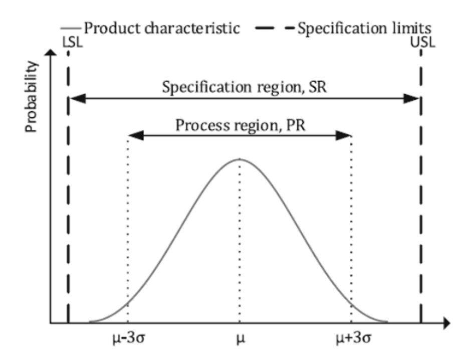
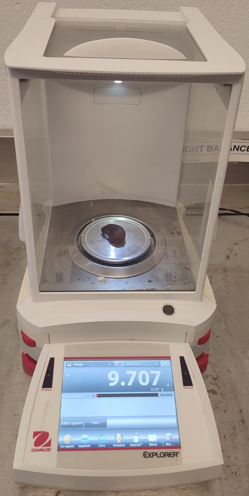
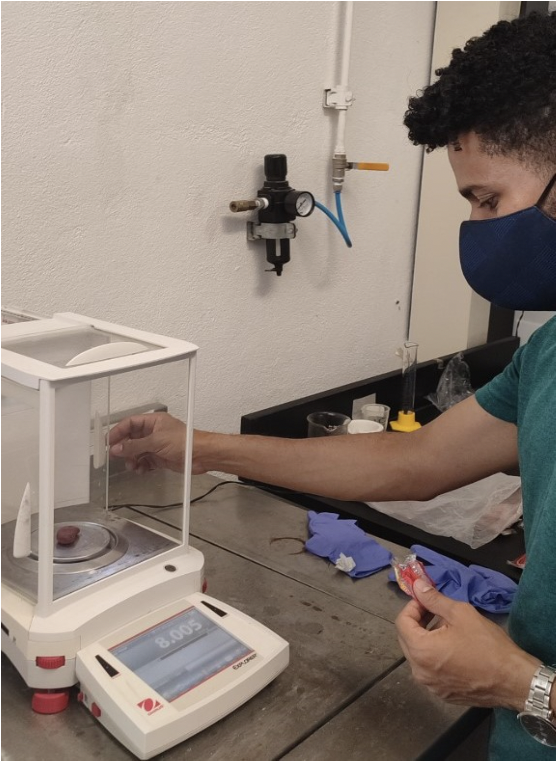
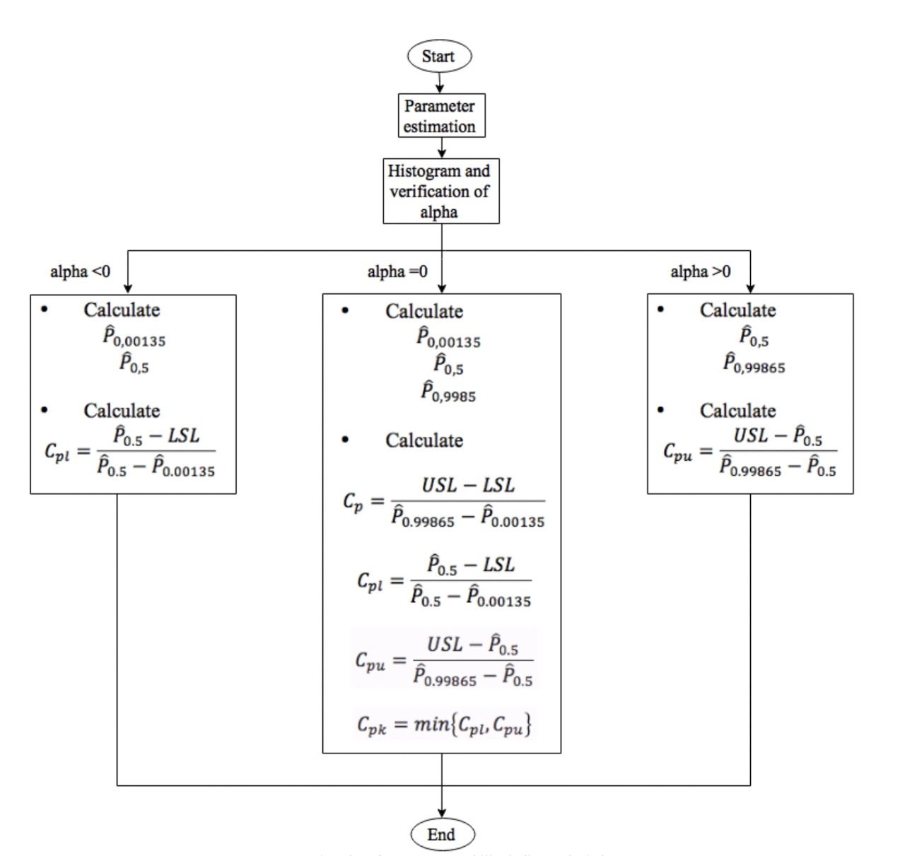

```{R echo = FALSE}
codejs <- readr::read_lines("./js/codefolding.js")
collapsejs <- readr::read_lines("./js/collapse.js")
transitionjs <- readr::read_lines("./js/transition.js")
dropdownjs <- readr::read_lines("./js/dropdown.js")

htmlhead <- c(
  paste('
<script>',
paste(transitionjs, collapse = "\n"),
'</script>
<script>',
paste(collapsejs, collapse = "\n"),
'</script>
<script>',
paste(codejs, collapse = "\n"),
'</script>
<script>',
paste(dropdownjs, collapse = "\n"),
'</script>
<style type="text/css">
.code-folding-btn { 
  margin-bottom: 4px; 
  color: #fff;
  background-color: #007bff;
  border-color: #007bff;
  border-radius: 0.25rem;
  border: 1px solid transparent;
  padding: 0.375rem 0.75rem;
  transition: color .15s ease-in-out,background-color .15s ease-in-out,border-color .15s ease-in-out,box-shadow .15s ease-in-out;
}
.row { display: flex; }
.collapse { display: none; }
.in { display:block }
.pull-right > .dropdown-menu {
    right: 0;
    left: auto;
}
.open > .dropdown-menu {
    display: block;
}
.dropdown-menu {
    position: absolute;
    top: 100%;
    left: 0;
    z-index: 1000;
    display: none;
    float: left;
    min-width: 160px;
    padding: 5px 0;
    margin: 2px 0 0;
    font-size: 14px;
    text-align: left;
    list-style: none;
    background-color: #fff;
    -webkit-background-clip: padding-box;
    background-clip: padding-box;
    border: 1px solid #ccc;
    border: 1px solid rgba(0,0,0,.15);
    border-radius: 4px;
    -webkit-box-shadow: 0 6px 12px rgba(0,0,0,.175);
    box-shadow: 0 6px 12px rgba(0,0,0,.175);
}
.personalized-button {
    color: #fff;
    background-color: #007bff;
    border-color: #007bff;
    border-radius: 0.25rem;
    border: 1px solid transparent;
    padding: 0.375rem 0.75rem;
    transition: color .15s ease-in-out,background-color .15s ease-in-out,border-color .15s ease-in-out,box-shadow .15s ease-in-out;
}
</style>
<script>
$(document).ready(function () {
  window.initializeCodeFolding("show" === "hide");
});
</script>
', sep = "\n"),
  paste0('
<script>
document.write(\'<div class="btn-group pull-right" style="position: absolute; top: 20%; right: 2%; z-index: 200"><button type="button" class="btn btn-default btn-xs dropdown-toggle personalized-button" data-toggle="dropdown" aria-haspopup="true" aria-expanded="true" data-_extension-text-contrast=""><span>Code</span> <span class="caret"></span></button><ul class="dropdown-menu" style="min-width: 50px;"><li><a id="rmd-show-all-code" href="#">Show All Code</a></li><li><a id="rmd-hide-all-code" href="#">Hide All Code</a></li></ul></div>\')
</script>
')
)

readr::write_lines(htmlhead, path = "./header.html")
```

# Process Capability

Read about the concept of process capability. Select a real process and a corresponding quality characteristic you can measure quantitatively. Take a random sample of the quality characteristic and measure the process capability.

1.  Describe the concept of process capability and its measurements.
2.  Collect data.
3.  Plot the data using graphical summaries.
4.  Describe the data using summary statistics.
5.  Evaluate the distribution of the data using probability plots.
6.  Measure the capability.
7.  Estimate the measurement error of your capability measure using simulation.

```{R echo = FALSE}
specify_decimal <- function(x, k) trimws(format(round(x, k), nsmall=k))
suppressWarnings(library(kableExtra))
```

## Concept definition

Process capability analysis is concerned with evaluating the ability of a process to produce products or services that meet specifications [@Yum_Kim_2011]. Others authors agree with defining process capability as "a statistical measure of the inherent process variability of a given characteristic" [<https://asq.org/quality-resources/process-capability>]. This statistical technique to attribute a value to Process Capability is necessary for the whole cycle of production of a product/service, for a correct evaluation of customer/market requests (VOC, "Voice of Customer") and process performance (VOP, "Voice of Process") [@Arcidiacono2017ARO].

Capability analysis can rely either on historical data, or on data specifically collected for the purpose of the analysis itself. Data collected from such analysis are useful to:

-   Predict how the process will comply with the tolerances.
-   Assist the research and development of the process changes.
-   Establish the sampling frequency for the evaluation procedures.
-   Establish the performance requirements of new equipment.
-   Select suppliers.
-   Plan production even in presence of interaction of the process on the tolerances.
-   Reduce process variability.

In short, a process is described as capable if it is able to produce products within the specification limits (SLs). Thus, PCIs are indicators of the goodness of the process related to the position and the variability of the measures within the SLs and are extensively accepted and used in the industry [@de-Felipe_Benedito_2017].

Like any analysis, the process capability applies some tools to evaluate such ability, these tools are known as "Process capability indices (PCIs)" [@Yum_Kim_2011]. When dealing with Continuous Improvement of quality, and for Lean Six Sigma Programs, Process Capability Indices (PCI) are considered some of the fundamentals quality measurement tools needed. This is because they evaluate related process performance, and compare one material or supplier with others, when applied properly to improve process control performance. By using Capability Indices, Process Capability Analysis compares the output of a stable process to the specification limits, and it is a measurement with respect to inherent precision of a manufacturing process [@Arcidiacono2017ARO].

In capability analysis, it is possible to distinguish between univariate and multivariate PCIs. On the one hand, univariate PCIs can be used, independently, to calculate the capability related to one single-product characteristic. On the other hand, multivariate PCIs describe the capability of a multivariate process by taking into account all product characteristics in a global way [@de-Felipe_Benedito_2017]. In this project, univariate PCIs will be used, hence, they just will be described as follows.

### *Univariate process capability indices*

Univariate PCIs are statistical indicators used to quantify the goodness of a process by relating the variability of the measures of a single-product characteristic with the admissible one.

@sullivan1981problem introduced in the literature the univariate PCIs $C_p$, and $C_{pk}$. Henceforth, two concepts are introduced: the process region (PR) and the specification region (SR). The PR is defined as the interval that includes $99.73\%$ of values drawn from a normal distribution and which is centered on the mean value of the measured product characteristic.

Thus, in the univariate case, the lowest point of the PR is placed at $\mu − 3\sigma$; and the highest point at $\mu + 3\sigma$. The SR is defined as the interval limited by the lower specification limit (LSL) and the upper specification limit (USL) [@de-Felipe_Benedito_2017].

### *The* $C_p$ *index*

The process capability index is an approach for establishing the relationships between the actual process performance and the manufacturing specifications. The $C_p$ index is designed to provide an indirect measure of the potential ability to meet those requirements [@Tsai_Chen_2006]. With this index, the width of SR (USL − LSL) and the width of the PR ($6\sigma$) are compared. Figure \@ref(fig:process-specification) shows both regions. The $C_p$ index can be calculated with this formula:

$$ C_p = \frac{USL - LSL}{6\sigma} $$

```{R process-specification, fig.cap="Process and specification regions. Source: @de-Felipe_Benedito_2017", fig.align = 'center'}

```

Unfortunately, obtaining measures of the whole population is usually difficult, if not impossible. Thus, many times, it is not possible to describe the PR with its real variance ($\sigma$). For this reason, many times, the variance is estimated with the standard deviation (s) of a data sample [@de-Felipe_Benedito_2017], so in this case, the following equivalence will be used:

$$ C_p = \frac{USL - LSL}{6s} $$

The value of $C_p$ helps to better understand process performance. For example, if it is greater than $1.33$, which corresponds to the percentage of non-conforming items of $63$ parts per million (ppm), process performance is satisfactory for a centered process.

According to @Tsai_Chen_2006 the quality condition of the process assessed is determined by the table \@ref(tab:quality-conditions).

```{R quality-conditions}
cp <- c('$C_p \\geq 2.00$', '$1.67 \\leq 2.00$', '$1.33 \\leq 1.67$', '$1.00 \\leq 1.33$', '$0.67 \\leq 1.33$', '$\\lt 0.67$')
qualCond <- c("Super excellent", "Excellent", "Satisfactory", "Capable", "Inadequate", "Poor")

tabla_quality_conditions <- data.frame(cp, qualCond)

colnames(tabla_quality_conditions) <- c("$C_p$", "Quality condition")

knitr::kable(tabla_quality_conditions, align = "c", caption = "Quality Conditions and $C_p$ values for centered process")%>%
  kable_styling(full_width = F)%>%
  scroll_box(width = "100%", height = "100%", fixed_thead = T)
```

The $C_p$ index only takes into account the width of the PR, but it does not consider its position within the SR. If the PR is not centered on the SR, it would be possible to have a substantial percentage of products with characteristics outside the SL although the $C_p$ value is high. In order to solve this problem, the $C_{pk}$ indices was also introduced [@de-Felipe_Benedito_2017].

$C_{pk}$ index is used to relate process variability, by showing how a process conforms to its specifications. $C_{pk}$ is generally used to relate the "Natural Tolerances ($\pm3\sigma$)" to the specification limits. $C_{pk}$ describes how well the process is comprised within the specification limits, with reference to the the process mean [@Arcidiacono2017ARO].

$$C_{pk} = min(C_{pku},C_{pkl})$$ where:

$$C_{pku} = \frac{USL - \mu}{3s}$$

$$C_{pkl} = \frac{\mu - LSL}{3s}$$

## Data collected

The population for this project is *tangible*, and it consists of a mexican candy named "Go mango Enchilado", see Figure \@ref(fig:mango-enchilado). The following experiment is a *One-Sample Experiment*, where a random sample was obtained by buying the candy from a convenience store. The data studied here is *numerical type*, as the object of study is the *weight* of the candy, in *grams*. This study is *observational*, as the sample parameters of the population cannot be modified by the authors of this paper. The size of the sample is $n = 35$.

```{R mango-enchilado, fig.cap="Wrapper of Go mango Enchilado candy", fig.align = 'center', out.width = '60%'}

```

The measurements of the sample were taken using a weighing machine "Ohaus Explorer Analytical EX224", which has a resolution of 1 milligram, see Figure \@ref(fig:ohaus-explorer). The measurements were taken by placing the candy inside the cabin of the weighing machine, closing the dare, and recording the values from the machine, as seen in Figure \@ref(fig:weight-measurements).

```{R ohaus-explorer, fig.cap="Example of a measurement using Ohaus Weighing Machine", fig.align = 'center', out.width = '30%'}

```

```{R weight-measurements, fig.cap="Weight measurements taken and recorded", fig.show = "hold", out.width = '50%', fig.align = 'center'}


```

The weight results can be seen in the following table:

```{R}
peso <- c(9.285,9.748,7.676,9.425,9.707,8.005,9.531,7.818,9.956,9.264,9.370,10.422,9.400,9.293,9.233,9.704,9.773,9.562,10.032,9.772,9.984,9.699,8.677,9.160,9.762,9.674,8.949,8.808,9.336,10.271,10.234,10.445,8.978,9.331,8.810)

tabla_peso <- data.frame(1:35, peso)

colnames(tabla_peso) <- c("Number of elements", "Weight of candy (g)")

kbl(tabla_peso, align = "c", caption = "Weight of 35 candies")%>%
  kable_styling(position = "center", full_width = F)%>%
  scroll_box(width = "100%", height = "800px", fixed_thead = T, extra_css = "margin-left: auto; margin-right: auto;")
```

## Graphical Summaries and Summary Statistics

The results from the measurements are presented in Table \@ref(tab:summary-statistics).

```{R summary-statistics}
statistic <- c("Sample size ($n$)", "Sample mean ($\\bar{X}$)", "Median", "Sample standard deviation ($s$)")

sample_size <- length(peso)
sample_mean <- mean(peso)
sample_median <- median(peso)
sample_std_dev <- sd(peso)

values <- c(paste(sample_size, " units"), paste(specify_decimal(sample_mean, 4), "g"), paste(specify_decimal(sample_median, 4), "g"), paste(specify_decimal(sample_std_dev, 4), "g"))

summary_statistics <- data.frame(
  "Statistic" = statistic,
  "Value" = values
)

knitr::kable(summary_statistics, col.names = names(summary_statistics), align = "c", caption = "Summary Statistics from the candy weights")%>%
  kable_styling(full_width = F)%>%
  scroll_box(width = "100%", height = "100%", fixed_thead = T)
```

Figure \@ref(fig:weight-histogram) shows the distribution of the weights of the candy, presented in a histogram. The data shows *Negative Skewness*, as it is left skewed and the Mean `r specify_decimal(sample_mean, 4)` g, is smaller than the Median `r specify_decimal(sample_median, 4)` g. However, it approximates a normal distribution. As it can be seen, even though the candy´s weight is supposed to be 8 grams, most of the candies in the sample show a considerably higher weight.

```{R weight-histogram, fig.cap="Distribution of measurements for \"Go mango Enchilado Candy\"", fig.align = 'center', out.width = "80%"}
h <- hist(x = peso, main = "Weight histogram", xlab = "Weight (g)", ylab = "Frequency", col = "green")

xfit <- seq(min(peso), max(peso), length = 40) 
yfit <- dnorm(xfit, mean = sample_mean, sd = sample_std_dev) 
yfit <- yfit * diff(h$mids[1:2]) * sample_size 

lines(xfit, yfit, col = "red", lwd = 2)
```

```{R weight-box, fig.cap="Box plot and whiskers graph of the measurements for \"Go mango Enchilado Candy\"", fig.align = 'center', out.width = "80%"}
boxplot_data <- boxplot(x = peso, main = "Weight boxplot", col = 'green', ylab = "Weight (g)", outpch = 8)

lower_whisker <- min(boxplot_data$stats)
upper_whisker <- max(boxplot_data$stats)
```

On the other hand, Table \@ref(tab:weight-box-table) shows the statistics for box plot and whiskers, while Figure \@ref(fig:weight-box), shows the graph itself for the weight measurements. As it can be seen, the product´s weight does not fit within the box plot and whiskers graph, as it goes from `r lower_whisker` to `r upper_whisker` grams. The measurement that is the closest to said value, 8.005 grams, is actually an outlier in the graph. This could lead to pondering questions, is the population of candy actually weighting more than the value said by the manufacturer?

```{R weight-box-table}
#Type 6 to match excel and minitab
boxplot_quantiles <- quantile(peso, type = 6)
boxplot_iqr <- IQR(peso, type = 6)

boxplot_table_data <- c(boxplot_quantiles[2], boxplot_quantiles[4], specify_decimal(boxplot_iqr, 4), paste(lower_whisker, upper_whisker, sep=", "), toString(boxplot_data$out))
boxplot_table_titles <- c("Q1", "Q3", "IQR", "Whiskers", "Outliers")

boxplot_table <- data.frame(
  "Statistic" = boxplot_table_titles,
  "Value" = boxplot_table_data
)

knitr::kable(boxplot_table, col.names = names(boxplot_table), align = "c", caption = "Box plot statistics")%>%
  kable_styling(full_width = F)%>%
  scroll_box(width = "100%", height = "100%", fixed_thead = T)
```

```{R weight-stem, fig.cap="Stem and Leaf graph for the measurements taken", fig.align = 'center', out.width = "80%"}
stem(peso)
```

## Probability plots

The steps for the elaboration of probability plots are as follows: 

1. Order the sample date from the minor to the major value as shown in the third column of the table \@ref(tab:weight-probability-plot-table). 
2. Create equidistant gaps with the equation $P = \frac{i-0.5}{n}$, where "i" goes from 1 to 35 according to the sample order established in the previous step. The P value is shown in the second column in the table \@ref(tab:weight-probability-plot-table). 
3. Calculate the expected values from a normal distribution $Q_i$ using the standard deviation and mean from the sample. The $Q_i$ values are shown in the fourth column of the table \@ref(tab:weight-probability-plot-table).

```{R weight-probability-plot-table}
#To get the P=(i-0.5)/n values
probPpoints <- ppoints(peso);
#Order values for Xi column in probability plot
xi <- sort(peso)
#To get the inverse of the normal distribution (get value from probability)
i <- 1
qi <- vector(mode = "numeric", length = sample_size)
for (element in probPpoints) {
  qi[i] <- qnorm(element, sample_mean, sample_std_dev)
  i = i + 1
}

prob_plot_table <- data.frame(1:35, probPpoints, xi, qi)

colnames(prob_plot_table) <- c("i", "$P = \\frac{i - 0.5}{n}$", "$X_i$", "$Q_i$")

kbl(prob_plot_table, align = "c", caption = "Weight probability plots", escape = FALSE)%>%
  kable_styling(position = "center", full_width = F)%>%
  scroll_box(width = "460px", height = "800px", fixed_thead = T, extra_css = "margin-left: auto; margin-right: auto; margin-bottom: 25px;")
```

4.  Since the goal is to determine whether the sample might have come from a normal population and it is known that the most plausible normal distribution is the one whose mean and standard deviation are the same as the sample mean and standar deviation, thus we will construct a cumulative distribution function (cdf) $F(x)$ of the $N(35, 0.658^2)$ distribution. To achieve this curve, a $X_i$ vs $P$ graphics is elaborated.

```{R weight-probability-plot-table-cdf, fig.cap = "Weight CDF", fig.align = 'center', out.width = "80%"}
#We don't know if our sample follows a normal distribution. To check out, we first check the CDF. To check the CDF we generate values that come from a normal distribution with the mean and std dev from out sample. This is Qi. From Qi we generate the CDF and we plot the point from out sample on top of the curve

#To get a function of the CDF
x <- ecdf(qi)
#To get max and min values in qi
range_values <- range(qi)
#Give margin
min_val_cdf <- floor(range_values[1])
max_val_cdf <- ceiling(range_values[2])

#To plot a CDF
curve(x, min_val_cdf, max_val_cdf, col = "red", lwd = 5, xlab = "Weight", ylab = "Probability", main = "Cumulative distribution function")

#Plot point from sample on top of CDF
points(xi, probPpoints, col = "green", pch = 19)

#To add a legend
legend("topleft", legend=c(paste("CDF with N(", specify_decimal(sample_mean, 4), ",", specify_decimal(sample_std_dev^2, 4), ")", collapse = ""), "Sample points"), col=c("red", "green"), lty=c(1,3), lwd = 5, cex=0.8, text.font = 4, bg = 'lightblue')
```

With figure \@ref(fig:weight-probability-plot-table-cdf), we can have evidence each $Q_i$ is close to its corresponding $X_i$, therefore, a probability plot will be created. If our sample would come from a normally distributed population, the points should lie close to straight line in a $(X_i, Q_i)$ plot.

```{R weight-probability-plot, fig.cap = "Weight probability plot", fig.align = 'center', out.width = "80%"}
#To create quantile-quantile (probability plot)
qqnorm(peso, main = "Probability plot for weight data", col = "green", pch = 19)
#The data from our measurements is plotted against theoretical normally distributed quantiles

#To create straight line for QQ plot
qqline(peso, col = "red", lwd = 3, qtype = 6, distribution = qnorm)
```

Since in the figure \@ref(fig:weight-probability-plot) the sample points are close to the line, it is quite plausible that the sample came from a normal distribution.

## Capability measurement

To calculate the process capacity, we must take into account the following considerations:

-   As mentioned above, the measured product declares a mean value of the population's weight of $8 g$, that is, $\mu=8g$.
-   Since the population standard deviation is not known, the standard deviation of the sample(s) is adjusted. This is valid, based on what was declared in point a).
-   The specification limits will be calculated according to the *Official Mexican Standard NOM-002-SCFI-2011*, which states that for products weighing less than or equal to $50 g$, the tolerance allowed is $9\%$, as shown in the table \@ref(tab:nom-tolerance-table).

```{R nom-tolerance-table}
population_mean <- 8
tolerance <- 0.09

nom_tolerance_data <- c("$9.00\\%$", "$4.5g$ or $ml$", "$4.50\\%$")
nom_declared_content <- c("$0 g - 50 g$", "$50 g - 100 g$", "$100 g - 200 g$")

nom_table <- data.frame(
  "Declared net content in g or ml" = nom_declared_content,
  "Tolerance" = nom_tolerance_data
)

knitr::kable(nom_table, col.names = gsub(".", " ", names(nom_table)), align = "c", caption = "NOM-002-SCFI-2011 specification Limit")%>%
  kable_styling(full_width = F)%>%
  scroll_box(width = "100%", height = "100%", fixed_thead = T)
```

For our case the upper and lower specification limits are obtained as follows:

$$USL = \mu+(\mu*tolerance)$$ $$LSL = \mu-(\mu*tolerance)$$

```{R}
USL <- population_mean + (population_mean * tolerance)
LSL <- population_mean - (population_mean * tolerance)
```

Thus, the values for USL and LSL are $USL =$ `r USL`, $LSL =$ `r LSL`.

By applying the equation:

$$C_p = \frac{USL - LSL}{6s}$$

The obtained result are shown in the next table:

```{R process-capability-table}
Cp <- (USL - LSL)/(6 * sample_std_dev)

variable_of_interest <- c("$\\mu$", "Tolerance", "$s$", "$USL$", "$LSL$", "$C_p$")
quantity_obtained <- c(population_mean, tolerance*100, specify_decimal(sample_std_dev, 4), USL, LSL, specify_decimal(Cp, 4))
corresponding_units <- c("$g$", "$\\%$", "$g$", "$g$", "$g$", "")

process_capability_table <- data.frame(
  "Variable" = variable_of_interest,
  "Quantity" = quantity_obtained,
  "Unit" = corresponding_units
)

knitr::kable(process_capability_table, col.names = names(process_capability_table), align = "c", caption = "Process capability table")%>%
  kable_styling(full_width = F)%>%
  scroll_box(width = "100%", height = "100%", fixed_thead = T)
```

According to the quality condition table, $C_p < 0.67$, therefore, it is determined that the process has a **poor quality**.

Following the formula, it was found that the $C_{pk}$ of this product is:

$$C_{pk} = min(\frac{\bar{X}-LSL}{3s}, \frac{USL-\bar{X}}{3s})$$

```{R process-capability-complete-table}
CpL <- (sample_mean - LSL)/(3 * sample_std_dev)
CpU <- (USL - sample_mean)/(3 * sample_std_dev)
CpK <- pmin(CpU, CpL)

variable_of_interest_complete <- c("$\\mu$", "Tolerance", "$s$", "$USL$", "$LSL$", "$C_p$", "$C_{pLower}$", "$C_{pUpper}$", "$C_{pk}$")
quantity_obtained_complete <- c(population_mean, tolerance*100, specify_decimal(sample_std_dev, 4), USL, LSL, specify_decimal(Cp, 4), specify_decimal(CpU, 4), specify_decimal(CpL, 4), specify_decimal(CpK, 4))
corresponding_units_complete <- c("$g$", "$\\%$", "$g$", "$g$", "$g$", "", "", "", "")

process_capability_table_complete <- data.frame(
  "Variable" = variable_of_interest_complete,
  "Quantity" = quantity_obtained_complete,
  "Unit" = corresponding_units_complete
)

knitr::kable(process_capability_table_complete, col.names = names(process_capability_table_complete), align = "c", caption = "Complete process capability table")%>%
  kable_styling(full_width = F)%>%
  scroll_box(width = "100%", height = "100%", fixed_thead = T)
```

This $C_{pk}$ value is negative, which indicates **poor capability** of the process, as it is yielding results out of the specified tolerances, therefore not meeting the process requirements. 

A more thorough analysis is conducted beneath using SixSigma library.

```{R fig.align = 'center', out.width = "100%"}
# Import SixSigma package
library(SixSigma)

# Get the Z (sigma score) of the process
ss.ca.z(peso, LSL, USL)

# Get the Cp indices of the process
ss.ca.cp(peso, LSL, USL)

# Get the Cp indices confidence intervals
ss.ca.cp(peso, LSL, USL, ci = TRUE)

# Get the Cpk indices of the process
ss.ca.cpk(peso, LSL, USL)

# Get the Cpk indices confidence intervals
ss.ca.cpk(peso, LSL, USL, ci = TRUE)

# Perform process capability analysis
# Plot text overflows (it looks ugly)
# ss.study.ca(peso,
#            LSL = LSL, 
#            USL = USL, 
#            Target = population_mean, 
#            alpha = 0.05, 
#            f.su = "Candy Weight Analysis")
```

## Error measurement estimation

The goal is finding a tolerance value $(\pm S_{cp})$ for our $C_p$ value:

$$C_p \pm S_{cp}$$
For achieving that target, a boopstraping is developed between the sample values, simulating 1000 standard deviation values. Thereupon, 1000 $C_p$ values were calculated by applying the equation:

$$C_p = \frac{USL - LSL}{6s}$$

Where $s$ corresponds to the standard deviation calculated from the simulated data.

```{R}
#Generate normally distributed data that follows the sample mean and standard deviation
# We will create 1000 simulated samples of size 6 in order to have enough data
n <- 1000
col <- 6

simulated_data <- matrix(nrow = n, ncol = col)
simulated_mean <- vector("numeric", n)
simulated_std_dev <- vector("numeric", n)
simulated_cp <- vector("numeric", n)
simulated_cpk_min <- vector("numeric", n)
for (i in 1:1000) {
  simulated_data[i,] = rnorm(col, sample_mean, sample_std_dev)
  simulated_mean[i] = mean(simulated_data[i,])
  simulated_std_dev[i] = sd(simulated_data[i,])
  simulated_cp[i] = ((USL - LSL) / (6*simulated_std_dev[i]))
  simulated_cpk_min[i] = pmin((simulated_mean[i] - LSL)/(3 * simulated_std_dev[i]), (USL - simulated_mean[i])/(3 * simulated_std_dev[i]))
}
```

```{R simulated-data-table}
elements_numbers <- 1:1000
simulated_data_1 <- simulated_data[,1]
simulated_data_2 <- simulated_data[,2]
simulated_data_3 <- simulated_data[,3]
simulated_data_4 <- simulated_data[,4]
simulated_data_5 <- simulated_data[,5]
simulated_data_6 <- simulated_data[,6]
table_titles <- c("i", "$X_1^*$", "$X_2^*$", "$X_3^*$", "$X_4^*$", "$X_5^*$", "$X_6^*$", "$s^*$", "$C_p^*$", "$C_{pkMin}^*$")

simulated_data_table <- data.frame(elements_numbers, specify_decimal( simulated_data_1, 4), specify_decimal(simulated_data_2, 4), specify_decimal(simulated_data_3, 4), specify_decimal(simulated_data_4, 4), specify_decimal(simulated_data_5, 4), specify_decimal(simulated_data_6, 4), specify_decimal(simulated_std_dev, 4), specify_decimal(simulated_cp, 4), specify_decimal(simulated_cpk_min, 4))

colnames(simulated_data_table) <- table_titles

knitr::kable(simulated_data_table, align = "c", caption = "Simulated data table")%>%
  kable_styling(position = "center", full_width = F)%>%
  scroll_box(width = "100%", height = "800px", fixed_thead = T, extra_css = "margin-left: auto; margin-right: auto;")
```

```{R}
cp_std_dev <- sd(simulated_cp)
cpkMin_std_dev <- sd(simulated_cpk_min)
```

Finally, the standard deviation of those 1000 values correspond to the tolerance value, resulting:

$$`r specify_decimal(Cp, 4)` \pm `r specify_decimal(cp_std_dev, 4)`$$

The same procedure was applied for the $C_{pk}$, calculating the minimum $C_{pK}$ for the same 1000 bootstrap samples, and then calculating the standard deviation for these values, resulting in:

$$C_{pk} = min(\frac{\bar{X}-LSL}{3s}, \frac{USL-\bar{X}}{3s})$$

$$`r specify_decimal(CpK, 4)` \pm `r specify_decimal(cpkMin_std_dev, 4)`$$

### *Percentiles method*

When the population doesn't follow a normal distribution, the calculation of $C_p$ and $C_{pk}$ can't be performed using the method described above.

This will require non-parametric methods like Clement's, or Burr's percentile method, or Box-Cox transformation. 
Each method is described briefly beneath:

- Clement's percentile method: It uses a family of Pearson Curves to calculate the indices. It proposes two changes to the parametric method. 
  - Instead of using the mean as measure of central tendency it uses the median. 
  - Instead of using the values of the percentile points from normal distributions it takes them from non-normal ones. 

In this case, the PCIs are defined as:
$$C_p = \frac{USL - LSL}{P_{0.99865} - P_{0.00135}}$$

$$C_{pl} = \frac{P_{0.5} - LSL}{P_{0.5} - P_{0.00135}}$$

$$C_{pu} = \frac{USL - P_{0.5}}{P_{0.99865} - P_{0.5}}$$

where $P_q$ is the $q-th$ percentile value of non-normal
distribution.

- Burr's percentile method: Same as Clement's but with the slight modification that instead of a family of Pearson distribution curves an appropriated Burr XII distribution is used. 
- Box-Cox Transformation method: Original data is transformed and then modified using conventional methods so that the output data can be considered as normal. 

@Agudelo_Cogollo_2016 proposes an adaptation of Clement's method that can be summarized in figure \@ref(fig:non-parametric-cp).

```{R non-parametric-cp, fig.cap="Flowchart for process capability indices calculation", fig.align = 'center', out.width = '80%'}

```