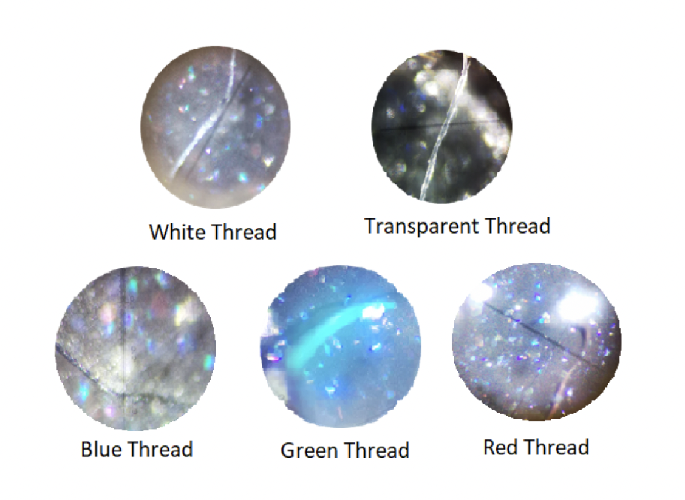

```{R echo = FALSE}
codejs <- readr::read_lines("./js/codefolding.js")
collapsejs <- readr::read_lines("./js/collapse.js")
transitionjs <- readr::read_lines("./js/transition.js")
dropdownjs <- readr::read_lines("./js/dropdown.js")

htmlhead <- c(
  paste('
<script>',
paste(transitionjs, collapse = "\n"),
'</script>
<script>',
paste(collapsejs, collapse = "\n"),
'</script>
<script>',
paste(codejs, collapse = "\n"),
'</script>
<script>',
paste(dropdownjs, collapse = "\n"),
'</script>
<style type="text/css">
.code-folding-btn { 
  margin-bottom: 4px; 
  color: #fff;
  background-color: #007bff;
  border-color: #007bff;
  border-radius: 0.25rem;
  border: 1px solid transparent;
  padding: 0.375rem 0.75rem;
  transition: color .15s ease-in-out,background-color .15s ease-in-out,border-color .15s ease-in-out,box-shadow .15s ease-in-out;
}
.row { display: flex; }
.collapse { display: none; }
.in { display:block }
.pull-right > .dropdown-menu {
    right: 0;
    left: auto;
}
.open > .dropdown-menu {
    display: block;
}
.dropdown-menu {
    position: absolute;
    top: 100%;
    left: 0;
    z-index: 1000;
    display: none;
    float: left;
    min-width: 160px;
    padding: 5px 0;
    margin: 2px 0 0;
    font-size: 14px;
    text-align: left;
    list-style: none;
    background-color: #fff;
    -webkit-background-clip: padding-box;
    background-clip: padding-box;
    border: 1px solid #ccc;
    border: 1px solid rgba(0,0,0,.15);
    border-radius: 4px;
    -webkit-box-shadow: 0 6px 12px rgba(0,0,0,.175);
    box-shadow: 0 6px 12px rgba(0,0,0,.175);
}
.personalized-button {
    color: #fff;
    background-color: #007bff;
    border-color: #007bff;
    border-radius: 0.25rem;
    border: 1px solid transparent;
    padding: 0.375rem 0.75rem;
    transition: color .15s ease-in-out,background-color .15s ease-in-out,border-color .15s ease-in-out,box-shadow .15s ease-in-out;
}
</style>
<script>
$(document).ready(function () {
  window.initializeCodeFolding("show" === "hide");
});
</script>
', sep = "\n"),
  paste0('
<script>
document.write(\'<div class="btn-group pull-right" style="position: absolute; top: 20%; right: 2%; z-index: 200"><button type="button" class="btn btn-default btn-xs dropdown-toggle personalized-button" data-toggle="dropdown" aria-haspopup="true" aria-expanded="true" data-_extension-text-contrast=""><span>Code</span> <span class="caret"></span></button><ul class="dropdown-menu" style="min-width: 50px;"><li><a id="rmd-show-all-code" href="#">Show All Code</a></li><li><a id="rmd-hide-all-code" href="#">Hide All Code</a></li></ul></div>\')
</script>
')
)

readr::write_lines(htmlhead, path = "./header.html")
```

# Acceptance sampling

Read about acceptance sampling. Select a process where an input can be evaluated using a sampling scheme. Propose an acceptance sampling procedure using binomial or hypergeometric models.

1. Describe the concept of acceptance sampling.
2. Select a process where acceptance sampling can be implemented.
3. Evaluate at least three different scenarios (designs).
4. Define a sampling procedure based on the binomial or hypergeometric distribution. Determine the producer and consumer risk and describe how they relate to the type 1 error probability and the power of a test.
5. Present a numerical example.

```{R echo = FALSE}
specify_decimal <- function(x, k) trimws(format(round(x, k), nsmall=k))
suppressWarnings(library(kableExtra))
```

## Concept definition

In quality control, it is sometimes necessary to inspect batches of raw materials as well as finished products to ensure that certain quality levels are met with a good degree of confidence. Acceptance sampling is the inspection process of a sample of units extracted from a lot that is carried out with the purpose of accepting or rejecting the entire lot [@gutirrez_pulido_control_2013].

There are two possible options, that the batch is accepted, so it would go directly to be used; or the lot is rejected, then it would be returned to the supplier or may be subject to some other degree.

Acceptance sampling is useful in a variety of situations, including the following: when the inspection is carried out with destructive tests (a destructive test is a test in which a sampled item is no longer salable after it has been sampled), when $100\%$ inspection is impossible in technical or economic terms, or when the lot is made up of a large number of items.

### *Types of sampling plans*
A first level of classification of acceptance sampling plans is based on the type of quality characteristic (or variable) under analysis, which can be an attribute or continuous variables.

In plans by variables, a random sample is taken from the lot and each unit is measured for a quality characteristic of a continuous type (length, weight, volume, temperature, etc.).

In attribute plans, one or more samples are randomly drawn from a lot and each item in the sample is classified according to certain attributes as acceptable or defective; the number of defective parts is used to decide if the lot is accepted or not.

Since attribute acceptance sampling will be performed in this project, this concept is described in greater depth below.

### *Acceptance sampling by attributes*
The simplest form of an attribute sampling plan is a single attribute sampling, which is related to situations in which the results of the inspection can be classified into only two classes of outcomes: success and failure (a Bernoulli trial).

It is used in inspection by counting the number of defects found in the sample (Poisson distribution) or evaluating the proportion of defectives in a large process or batch (binomial distribution) or individual batches (hypergeometric distribution).

The implementation is very simple. It involves taking a random sample of size $n$ from a lot of size $N$. The number of defectives (or defects) $d$ is compared to an acceptance number $c$. If the number found is less than or equal to $c$, the lot is accepted. If the number found is greater than $c$, the lot is rejected [@schilling_neubauer_2017].

Attribute plans are classified according to the number of samples taken to reach a decision. In the simple sampling plan $(n,c)$ a sample of size $n$ is taken, and if $c$ or fewer defective units are found in it, the lot is accepted, or else it is rejected, as it was previously discussed.

In the double sampling plan, up to two samples can be taken to make the decision to accept or not. The idea is to take a first sample size smaller than the simple plan to detect the lots that are very “good” or those that are very “bad”. In cases where the first sample is not enough to take a decision, then the second sample is taken to reach a definitive conclusion.

The multiple sampling plan is an extension of the concept of double sampling, where an initial sample considerably smaller than the simple plan is taken, and if with it there is already enough evidence to sentence the lot, the appropriate decision is made accordingly, otherwise, a second sample is taken and an attempt is made to decide; but if this is still not possible, the process continues until the decision to accept or reject the lot is made, considering all the defectives found.

### *Batch characteristics and sample selection*

A very important aspect of acceptance sampling by attributes is the lot itself, as it influences the effectiveness of the acceptance sampling plan. The following is recommended for batches that will be submitted to an inspection plan.

1. Batches must be homogeneous. The units that make up a particular batch must have been manufactured under similar conditions in terms of machines, operators, raw material, time (dates), etc.
2. The lots must be formed in such a way that they do not complicate their handling during the inspection.
3. Batches should be as large as possible. This is due to the fact that in large batches it is necessary to inspect proportionally less than in small batches.

All acceptance sampling plans base their operation on the fact that the units selected for inspection are representative of the entire lot. Hence, the selection of the units that make up the sample must be done by applying a random sampling method. The above recommendations are made to ensure that a sample is as representative as possible of the entire lot.

### *Statistical aspects of acceptance sampling*

It has been stated that the items extracted in each sample depend on chance. Therefore, what is observed in a sample is not identical to what is in the population or lot. Hence, to make a certain decision about the population, but based on a sample, one must resort to statistical methods supported by a probability model. In acceptance sampling such a probabilistic model is the operating characteristic curve (OC curve).

### *Operating characteristic curve*

The operating characteristic (OC) curve is the fundamental tool for the analysis of a sampling plan. Two types of curves are recognized:

1. Type A: it is used to calculate the probabilities of acceptance of an isolated and small lot size. This type of curve plots the probability that the lot is accepted against lot proportion defective.
2. Type B: it is used to calculate probabilities of acceptance of a large lot or a lot that comes from a continuous flow of products. This type of curve plots the proportion of lots that will be accepted against process proportion defective.

In general, the OC curve has a wide range of $p$ values because in practice the proportion of defectives in a batch is not exactly known.

Naturally, the probability distributions used in generating these types of curves are inherently different. They depend on the measure in which the quantity is expressed, this includes:

* Attributes: Classification of units as defective or non-defective.
* Counting: enumeration of the occurrences of a given characteristic by number of units counted. 
* Variables: measurement of some characteristic using a continuous scale.

```{R recommended-distributions}
data_type <- c("$\\textbf{Attributes}$", "$\\textbf{Counting}$", "$\\textbf{Variables}$")
type_a_curve <- c("Hypergeometric", "$f$-Binomial", "Applicable continuous distribution")
type_b_curve <- c("Binomial", "Poisson", "Applicable continuous distribution")

tabla_recommended_distributions <- data.frame(data_type, type_a_curve, type_b_curve)

colnames(tabla_recommended_distributions) <- c("$\\textbf{Data type}$", "$\\textbf{Type A curve}$", "$\\textbf{Type B curve}$")

knitr::kable(tabla_recommended_distributions, align = "c", caption = "Recommended distribution for each type of data measured in the sample and the type of OC curve to be constructed")%>%
  kable_styling(full_width = F)%>%
  scroll_box(width = "100%", height = "100%", fixed_thead = T)
```

```{R operating-cc, fig.cap="Example of an Operating Characteristic Curve for a sampling plan with $n=205$ and $c=2$. AQL and LQL values (described later) and their relationship with the producer’s and consumer’s risk are shown. Taken from @gutirrez_pulido_control_2013", fig.align = 'center'}

```

Properties of OC curves:

1. There is no sampling plan that has an ideal OC curve, capable of perfectly distinguishing good lots from bad ones.
2. By increasing the sample size and the acceptance number, the obtained plans have greater power to distinguish good quality from poor.
3. The criterion of sample size equal to a percentage of the lot size is a bad criterion.
4. As the acceptance number decreases, the OC curve falls faster and with it the plans become more stringent.
5. Plans with $c=0$ (no defects) are not always the most appropriate.
6. The influence of lot size on properly designing sampling plans is less than it is commonly believed [@gutirrez_pulido_control_2013].

### *Important concepts in acceptance sampling*

In all process there are always two interests: on the one hand, the supplier wants all batches that meet an acceptable quality level to be approved; and on the other, the customer wants all batches that do not have an acceptable quality level to be rejected. It is not possible to simultaneously satisfy both interests by means of an acceptance sampling plan, but one thing can be done, and it is is to design acceptance sampling plans that have a high probability of accepting “good” lots and a low probability of accepting “bad” lots. To achieve this, it is necessary to establish, for a specific situation, what will be considered as acceptable, intermediate, and unacceptable quality, with their corresponding probabilities of acceptance. For this reason the terms Acceptable Quality Level, Limit Quality Level, and Average Outgoing Quality are defined.

Acceptable Quality Level, or AQL, is defined as the maximum percentage of units that do not meet the specified quality, which for sampling inspection purposes is considered satisfactory or acceptable as an average for the process (AQL is also known as producer quality level). According to the above, if a lot has a quality level equal to the AQL, then the probability of accepting it must be high $(0.90, 0.95)$, and this probability is designated as $1-\alpha$. Note that the probability of accepting lots with an AQL is not equal to 1 and therefore there is a risk of not accepting what is considered a satisfactory quality level. This risk that has a probability equal to $\alpha$, usually small $(0.05, 0.10)$, is known as the producer's risk.

Limit quality level, or LQL, is the level of quality that is considered unsatisfactory and lots that have this type of quality should almost always be rejected. The LQL in some specific plans is known as Lot Tolerance Proportion Defective, or LTPD. Due to the aforementioned, if a lot has a quality equal to the LQL, then the probability of accepting it must be very low (generally $0.05, 0.10$), and this probability is designated by the letter $\beta$. Note that the probability of accepting lots of unsatisfactory quality (LQL) is not zero and, therefore, there is a risk of not rejecting this type of lot. This risk, which has probability equal to $\beta$, is known as the consumer's risk.

Average Outgoing Quality, or AOQ, is the average quality that is reached after applying the inspection process. This concept is a way of measuring the effect of a sampling plan on the quality that it will have after applying it.

This calculation is performed in a similar way to how the operating characteristic curve is obtained, since for each proportion of defectives that the batch contains at the entrance, an average proportion of defectives at the exit (AOQ) is expected. By plotting the input proportion, $p$, against the average proportion defective after inspection, CPS, a curve for the average output quality (CPS curve) is obtained.

The CPS curve, when a large lot size is available, is obtained with the formula:

$$CPS = (p)(P_a)$$

Where $p$ is the proportion of defectives at the entry of the lot, and $P_a$ is the probability of acceptance of such lot provided by the sampling plan.

Average Outgoing Quality Limit, AOQL, it is defined as the maximum value of the CPS curve and represents the worst average quality that can be obtained from the inspection program.

### *Methods for designing sampling plans*

Procedures are available to determine the so-called simple two-point $(n,c)$ sampling plans for specified values of:

* Producer Quality Level (PQL)
* Consumer Quality Level (CQL)
* Producer risk $\alpha$
* Consumer risk $\beta$

An example of a method for designing acceptance sampling plans is the one published by Cameron [@cameron1952tables]. It is a procedure for designing simple sampling plans that satisfy a given AQL and LQL. It is based on the Poisson distribution and gives a good approximation to the binomial distribution.

There are some other methods of procedures for determining single sampling plans as using the Tables of Poisson Unity Values (such as Cameron Method), Binomial Nomograph, f-Binomial Nomograph, Thorndyke Chart, and Hypergeometric tables.

Also, the Military Standard 105E can be mentioned. The original version was created in 1950 [@united1950military]. It is currently the most widely used attribute acceptance sampling system in the world. Alternatively, its civil counterpart ANSI/ASQ Z1.4 can be used.

At this point it is necessary to distinguish between an acceptance sampling plan, an acceptance sampling scheme, and an acceptance sampling system.

An acceptance sampling plan is a plan that establishes the sample sizes to be used and the associated criteria for lot acceptance. An acceptance sampling scheme is a combination of acceptance sampling plans with switching rules to change from one plan to another. An acceptance sampling system is a collection of acceptance sampling plans or schemes together with criteria by which the appropriate plans or schemes are chosen [@iso2006statistics].

In this sense, MIL-STD-105E is not a sampling plan, it is a sampling system. As such, it combines various sampling plans into schemes constructed to employ economic, psychological, and operational means to motivate the producer to maintain quality at levels less than or equal to the AQL.

## *Process where acceptance sampling can be implemented*

The selected process is the measurement of impurities of car bodies after a painting process in a certain automotive process. It is divided into two phases:

* The first phase refers to the measurement of impurities in car bodies of a certain model.
* Second phase is related to the implementation of a process that will reduce impurities in the different stages of the painting process.

Broadly speaking, in the painting process in the automotive industry, the car body is provided with different layers, each of which corresponds to one or more unit operations, which are shown below:

```{R layers-painted, fig.cap="Layers during the painting process in a car body", fig.align = 'center'}

```

```{R painting-stages, fig.cap="Stages through which the car body passes during the painting process", fig.align = 'center'}
knitr::include_graphics("images/painting_stages.png")
```

The quality department is responsible for carrying out audits at the end of certain stages of the process, in which they determine the number of impurities found in the different areas of the car body. These audits bear the name of the stage and are shown below as well as a brief description of what happens in the process.

* **KTL Audit** - Cathodic electrodeposition process (Kathodische Tauchlackierung KTL) 
* **Filler Audi** - In this stage, the primer is applied to the entire car body, a primer and filler that guarantees the adherence of the final paint layer. 
* **Sandind Audit** - Although it is not a layer, it is a very important process, since it serves as a containment, that is, the possible impurities that adhered to the car body in the previous layers, at this stage is when they can be sanded from the surface both on the outside as well as inside. 
* **Detailed Audit** - When the car body leaves the paint booths, it goes through the Curing Oven and the Cooling Zone, to finally go to the Detailing area, in which a tactile and visual detection of the impurities that it may present will be carried out and so on, be able to remove them, here you can **sand, clean and polish the surface**.

The objective of these Audits is to maintain a lower rate of impurities, as well as to supervise that those impurities are not found in the most important areas of a car body, which are: the hood and the awning, since they are considered the parts in which the client puts its attention.

For this project we will focus on the best-selling model, "Model A" produced between 2019-2020 as well as on the impurity called "fiber", in the detailing stage, in Figure \@ref(fig:impurity-fiber) there are some examples of the impurity “fiber” observed in the car body. 

The purpose of this project is therefore to determine and evaluate three acceptance sampling plans for this process, in which the quality of an item, in this case the car body, is based on the number of observed impurities.

As there is a corrective process for every car body after an impurity is detected, it is stated that a **defective unit is that with more than 13 impurities**. Thus, those car bodies which have 13 or less impurities are considered as non-defective.

```{R impurity-fiber, fig.cap="Examples of the impurity “fiber” seen in the car body", fig.align = 'center'}

```

## *Three scenarios (design) evaluation*

We start by defining the type of sampling plan that will be implemented. As we have a dichotomous situation, that is, only two classes of outcomes, we will design a single sampling plan by attributes.

The data we will work with was obtained from measurements over a period of 11 weeks. 318 car bodies were analyzed, and the number of fibers (impurities) observed were recorded. The sample was drawn randomly from the production line and units were considered to have been produced under similar conditions. Thus, it can be considered that the sample is representative of the entire lot.

For the purposes of this project, we will not design a sampling scheme nor a sampling system, but a sampling plan, as we will determine the sample size that must be used and the acceptance criteria utilizing a specific method. The selected method is the one published by @cameron1952tables because we want the values of AQL and LQL to be met as best as possible and because it is known that this method provides a good approximation to the binomial distribution.

For designing the plans, we first need to specify the percentage values of AQL an LQL with its corresponding probability of acceptance, $1-\alpha$ and $\beta$, respectively.

We have a sample of size $n$ with two possible values: defective or non-defective, therefore, we know that the number of defective car bodies follow a binomial distribution. In statistical notation, let $X$ represent the number of defective car bodies in the lot, then $X\sim Bin(n,p)$, were $p$ (the proportion of defectives) is unknown. 

According to @navidi_2019, the proportion of defectives can be estimated using the sample proportion $\hat{p}$:

$$\hat{p} = \frac{X}{n}$$

Where $X$ are the observed number of defectives and $n$ the sample size, hence:

```{R}
X <- 19
n <- 318
p_hat <- X/n
sigma_p_hat <- sqrt((p_hat*(1-p_hat))/(n))
```

$$\hat{p} = \frac{`r X`}{`r n`} = `r specify_decimal(p_hat, 4)`$$

For this value to be useful we compute its uncertainty using:

$$\sigma_{\hat{p}} = \sqrt{\frac{p(1-p)}{n}}$$

Since $p$ is unknown, we substitute $p$ for $\hat{p}$ and we find that:

$$\sigma_{\hat{p}} = `r specify_decimal(sigma_p_hat, 4)`$$

We will use this value as a reference for determining AQL and LQL values.

Now, we can create a table with the required information for implementing Cameron’s Method for designing each sampling plan.

```{R}
#Data for plan A
planA_AQL <- 6
planA_LQL <- 10
planA_alpha <- 0.05
planA_beta <- 0.1

#Data for plan B
planB_AQL <- 4
planB_LQL <- 10
planB_alpha <- 0.05
planB_beta <- 0.01

#Data for plan C
planC_AQL <- 2.5
planC_LQL <- 10
planC_alpha <- 0.01
planC_beta <- 0.05
```

```{R AQL-LQL-values}
variable <- c("$AQL (\\%)$", "$LQL (\\%)$", "$\\alpha$", "$\\beta$")
plan_a <- c(planA_AQL, planA_LQL, planA_alpha, planA_beta)
plan_b <- c(planB_AQL, planB_LQL, planB_alpha, planB_beta)
plan_c <- c(planC_AQL, planC_LQL, planC_alpha, planC_beta)

tabla_AQL_LQL_values <- data.frame(variable, plan_a, plan_b, plan_c)

colnames(tabla_AQL_LQL_values) <- c("$\\textbf{Variable}$", "$\\textbf{Plan A}$", "$\\textbf{Plan B}$", "$\\textbf{Plan C}$")

knitr::kable(tabla_AQL_LQL_values, align = "c", caption = "AQL and LQL values")%>%
  kable_styling(full_width = F)%>%
  scroll_box(width = "100%", height = "100%", fixed_thead = T)
```

Next, the following steps should be performed for each plan:
1. We convert the percentages into proportions using the following expressions:

$$
\begin{align*}
&p_1 = \frac{AQL}{100}&&
p_2 = \frac{LQL}{100}
\end{align*}
$$
Then, we compute the following ratio:

$$R_c = \frac{p_1}{p_2}$$

With the Cameron’s Tables, using the established values of $\alpha$ and $\beta$, and the obtained value for $R_c$, one can determine a value $R$, which is the closest possible value of $R_c$ available in the Cameron’s Table. Then, the acceptance number $c$ and the value $np_1$ can be determined; the latter quantity can be used to find the sample size $(n=\frac{np_1}{p_1})$.

```{R cameron-table, fig.cap="Cameron's table used to obtain $R$, $c$, and $np_1$", fig.align = 'center'}
knitr::include_graphics("images/cameron_table.png")
```

Using the Cameron’s Tables \@ref(fig:cameron-table) available in @gutirrez_pulido_control_2013, the following information is obtained:

```{R}
#Results for plan A
planA_p1 <- planA_AQL/100
planA_p2 <- planA_LQL/100
planA_Rc <- planA_p2/planA_p1
planA_R <- 1.79
planA_c <- 25
planA_np <- 18.21
planA_n <- planA_np/planA_p1

#Results for plan B
planB_p1 <- planB_AQL/100
planB_p2 <- planB_LQL/100
planB_Rc <- planB_p2/planB_p1
planB_R <- 2.45
planB_c <- 18
planB_np <- 12.44
planB_n <- planB_np/planB_p1

#Results for plan C
planC_p1 <- planC_AQL/100
planC_p2 <- planC_LQL/100
planC_Rc <- planC_p2/planC_p1
planC_R <- 3.8
planC_c <- 9
planC_np <- 4.13
planC_n <- planC_np/planC_p1
```

```{R cameron-table-sampling-plan}
variable <- c("$p_1$", "$p_2$", "$R_c$", "$R$", "$c$", "$np_1$", "$n$")
plan_a <- c(specify_decimal(planA_p1, 4), specify_decimal(planA_p2, 4), specify_decimal(planA_Rc, 4), specify_decimal(planA_R, 4), specify_decimal(planA_c, 4), specify_decimal(planA_np, 4), specify_decimal(planA_n, 4))
plan_b <- c(specify_decimal(planB_p1, 4), specify_decimal(planB_p2, 4), specify_decimal(planB_Rc, 4), specify_decimal(planB_R, 4), specify_decimal(planB_c, 4), specify_decimal(planB_np, 4), specify_decimal(planB_n, 4))
plan_c <- c(specify_decimal(planC_p1, 4), specify_decimal(planC_p2, 4), specify_decimal(planC_Rc, 4), specify_decimal(planC_R, 4), specify_decimal(planC_c, 4), specify_decimal(planC_np, 4), specify_decimal(planC_n, 4))

cameron_table_plans <- data.frame(variable, plan_a, plan_b, plan_c)

colnames(cameron_table_plans) <- c("$\\textbf{Variable}$", "$\\textbf{Plan A}$", "$\\textbf{Plan B}$", "$\\textbf{Plan C}$")

knitr::kable(cameron_table_plans, align = "c", caption = "Information extracted from the Cameron's Table for each sampling plan design")%>%
  kable_styling(full_width = F)%>%
  scroll_box(width = "100%", height = "100%", fixed_thead = T)
```

Therefore, the three sampling plans can be summarized as follows:

```{R sampling-plans-summary}
plan <- c("$\\textbf{A}$", "$\\textbf{B}$", "$\\textbf{C}$")
acceptance_number <- c(planA_c, planB_c, planC_c)
sample_size <- c(ceiling(planA_n), ceiling(planB_n), ceiling(planC_n))

tabla_sampling_plans_summary <- data.frame(plan, acceptance_number, sample_size)

colnames(tabla_sampling_plans_summary) <- c("$\\textbf{Plan}$", "$\\textbf{Acceptance number (c)}$", "$\\textbf{Sample size (n)}$")

knitr::kable(tabla_sampling_plans_summary, align = "c", caption = "Sampling plans designed using the Cameron's Method")%>%
  kable_styling(full_width = F)%>%
  scroll_box(width = "100%", height = "100%", fixed_thead = T)
```

So, for example, plan A requires that a sample of size `r ceiling(planA_n)` is drawn from the lot and if less than or equal to `r planA_c` defectives are found the lot is accepted, otherwise the lot is rejected.

The next step should be to analyze these designs and to determine which one of them complies with the established values. As it was previously stated, the appropriate tool for this task is the OC curve.

## *Sampling procedure, producer and consumer risk, relation to type 1 error and power of a test*

Before constructing the OC curve, we must determine what type of curve fits with our data and what will be the appropriate probability distribution to estimate the acceptance probability. As our sample was drawn from a large batch, we will construct a type B curve. Furthermore, as our sampling plan is by attributes, then, according to Table \@ref(tab:recommended-distributions), the Binomial distribution should be used.

The first step for plotting the OC curve is to establish arbitrary values of the proportion of defectives $p$. Then, for each value of $p$, the probability of acceptance is estimated using the binomial distribution. The following table is obtained:

```{R acceptance-probability}
p <- seq(0.0, 0.150, by = 0.002)

n <- length(p)

p_a <- vector("numeric", n)
p_b <- vector("numeric", n)
p_c <- vector("numeric", n)

for (i in 1:n) {
  p_a[i] = pbinom(planA_c, ceiling(planA_n), p[i])
  p_b[i] = pbinom(planB_c, ceiling(planB_n), p[i])
  p_c[i] = pbinom(planC_c, ceiling(planC_n), p[i])
}

acceptance_probability_table <- data.frame(p, specify_decimal(p_a, 4), specify_decimal(p_b, 4), specify_decimal(p_c, 4))

colnames(acceptance_probability_table) <- c("$\\boldsymbol{p}$", "$\\boldsymbol{P_A}$", "$\\boldsymbol{P_B}$", "$\\boldsymbol{P_C}$")

knitr::kable(acceptance_probability_table, align = "c", caption = "Probability of acceptance for several proportions of defective for each sampling plan")%>%
  kable_styling(position = "center", full_width = F)%>%
  scroll_box(width = "100%", height = "800px", fixed_thead = T, extra_css = "margin-left: auto; margin-right: auto; margin-bottom: 25px;")
```

Next, the OC curve is built using data in Table \@ref(tab:acceptance-probability).

```{R oc-curve-complete, fig.cap = "OC curve for the three designed plans", fig.align = 'center', out.width = "80%"}

plot(p, p_a, type = "l", xlab = "Proportion of defectives", ylab = "Probability of acceptance", main = "OC Curve", col = "red", lwd = 5)
lines(p, p_b, col = "green", lwd = 5)
lines(p, p_c, col = "blue", lwd = 5)

#To add a legend
legend("topright", legend=c(paste("Plan A: n = ", ceiling(planA_n), "; c = ", planA_c, collapse = ""), paste("Plan B: n = ", ceiling(planB_n), "; c = ", planB_c, collapse = ""), paste("Plan C: n = ", ceiling(planC_n), "; c = ", planC_c, collapse = "")), col=c("red", "green", "blue"), lty=1, lwd = 5, cex=0.8, text.font = 4, bg = 'lightblue')
```

Then we calculate the producer’s and consumer’s risk,  and  respectively, utilizing the binomial distribution:

$$X_A\sim Bin(`r ceiling(planA_n)`, p)$$
$$X_B\sim Bin(`r ceiling(planB_n)`, p)$$
$$X_C\sim Bin(`r ceiling(planC_n)`, p)$$
The probability $p$ in the previous expressions is the one corresponding to the respective value of AQL (for $1 - \alpha$) and LQL (for $\beta$). The results are summarized in the next table:

```{R producer-consumer-risk}
#Plan A
planA_1_alpha <- pbinom(planA_c, ceiling(planA_n), planA_p1)
planA_alpha <- 1 - planA_1_alpha
planA_beta <- pbinom(planA_c, ceiling(planA_n), planA_p2)

#Plan B
planB_1_alpha <- pbinom(planB_c, ceiling(planB_n), planB_p1)
planB_alpha <- 1 - planB_1_alpha
planB_beta <- pbinom(planB_c, ceiling(planB_n), planB_p2)
  
#Plan C
planC_1_alpha <- pbinom(planC_c, ceiling(planC_n), planC_p1)
planC_alpha <- 1 - planC_1_alpha
planC_beta <- pbinom(planC_c, ceiling(planC_n), planC_p2)
  
risk <- c("$1-\\alpha$", "$\\alpha$", "$\\beta$")
planA <- c(specify_decimal(planA_1_alpha, 4), specify_decimal(planA_alpha, 4), specify_decimal(planA_beta, 4))
planB <- c(specify_decimal(planB_1_alpha, 4), specify_decimal(planB_alpha, 4), specify_decimal(planB_beta, 4))
planC <- c(specify_decimal(planC_1_alpha, 4), specify_decimal(planC_alpha, 4), specify_decimal(planC_beta, 4))

producer_consumer_risk_table <- data.frame(risk, planA, planB, planC)

colnames(producer_consumer_risk_table) <- c("$\\textbf{Risk}$", "$\\textbf{Plan A}$", "$\\textbf{Plan B}$", "$\\textbf{Plan C}$")

knitr::kable(producer_consumer_risk_table, align = "c", caption = "Producer's and consumer's risk")%>%
  kable_styling(full_width = F)%>%
  scroll_box(width = "100%", height = "100%", fixed_thead = T)
```

It is observed that for plan A the producer’s risk is below the limit; however, the consumer’s risk is greater than what was established in the plan design. For plans B and C, both the producer’s and consumer’s risk are within the defined limits.

The next figures show the AQL and LQL with their respective probability of acceptance, $1 - \alpha$ and $\beta$, respectively for each sampling plan based on the OC curve model shown in Figure \@ref(fig:operating-cc).

```{R oc-curve-planA, fig.cap = "OC curve for Plan A with the values of AQL and LQL and their corresponding probability of acceptance", fig.align = 'center', out.width = "80%"}
library(latex2exp)

plot(p, p_a, type = "l", xlab = "Proportion of defectives", ylab = "Probability of acceptance", main = "Plan A", col = "red", lwd = 5)
#AQL
# X0, X1                      #Y0, Y1
#Vertical
lines(c(planA_p1, planA_p1), c(0, planA_1_alpha), col = "green", lwd = 5)
#Horizontal
lines(c(0, planA_p1), c(planA_1_alpha, planA_1_alpha), col = "green", lwd = 5)
#LQL
#Vertical
lines(c(planA_p2, planA_p2), c(0, planA_beta), col = "blue", lwd = 5)
#Horizontal
lines(c(0, planA_p2), c(planA_beta, planA_beta), col = "blue", lwd = 5)

#To add a legend
legend("topright", legend=c(paste("Plan A: n = ", ceiling(planA_n), "; c = ", planA_c, collapse = ""), TeX(sprintf(r'($AQL (p_1) = %s ; 1 - \alpha = %s$)', specify_decimal(planA_p1, 4), specify_decimal(planA_1_alpha, 4))), TeX(sprintf(r'($LQL (p_2) = %s ; \beta = %s$)', specify_decimal(planA_p2, 4), specify_decimal(planA_beta, 4)))), col=c("red", "green", "blue"), lty=1, lwd = 5, cex=0.8, text.font = 4, bg = 'lightblue')
```

```{R oc-curve-planB, fig.cap = "OC curve for Plan B with the values of AQL and LQL and their corresponding probability of acceptance", fig.align = 'center', out.width = "80%"}
plot(p, p_b, type = "l", xlab = "Proportion of defectives", ylab = "Probability of acceptance", main = "Plan B", col = "red", lwd = 5)
#AQL
# X0, X1                      #Y0, Y1
#Vertical
lines(c(planB_p1, planB_p1), c(0, planB_1_alpha), col = "green", lwd = 5)
#Horizontal
lines(c(0, planB_p1), c(planB_1_alpha, planB_1_alpha), col = "green", lwd = 5)
#LQL
#Vertical
lines(c(planB_p2, planB_p2), c(0, planB_beta), col = "blue", lwd = 5)
#Horizontal
lines(c(0, planB_p2), c(planB_beta, planB_beta), col = "blue", lwd = 5)

#To add a legend
legend("topright", legend=c(paste("Plan B: n = ", ceiling(planB_n), "; c = ", planB_c, collapse = ""), TeX(sprintf(r'($AQL (p_1) = %s ; 1 - \alpha = %s$)', specify_decimal(planB_p1, 4), specify_decimal(planB_1_alpha, 4))), TeX(sprintf(r'($LQL (p_2) = %s ; \beta = %s$)', specify_decimal(planB_p2, 4), specify_decimal(planB_beta, 4)))), col=c("red", "green", "blue"), lty=1, lwd = 5, cex=0.8, text.font = 4, bg = 'lightblue')
```

```{R oc-curve-planC, fig.cap = "OC curve for Plan C with the values of AQL and LQL and their corresponding probability of acceptance", fig.align = 'center', out.width = "80%"}
plot(p, p_c, type = "l", xlab = "Proportion of defectives", ylab = "Probability of acceptance", main = "Plan C", col = "red", lwd = 5)
#AQL
# X0, X1                      #Y0, Y1
#Vertical
lines(c(planC_p1, planC_p1), c(0, planC_1_alpha), col = "green", lwd = 5)
#Horizontal
lines(c(0, planC_p1), c(planC_1_alpha, planC_1_alpha), col = "green", lwd = 5)
#LQL
#Vertical
lines(c(planC_p2, planC_p2), c(0, planC_beta), col = "blue", lwd = 5)
#Horizontal
lines(c(0, planC_p2), c(planC_beta, planC_beta), col = "blue", lwd = 5)

#To add a legend
legend("topright", legend=c(paste("Plan C: n = ", ceiling(planC_n), "; c = ", planC_c, collapse = ""), TeX(sprintf(r'($AQL (p_1) = %s ; 1 - \alpha = %s$)', specify_decimal(planC_p1, 4), specify_decimal(planC_1_alpha, 4))), TeX(sprintf(r'($LQL (p_2) = %s ; \beta = %s$)', specify_decimal(planC_p2, 4), specify_decimal(planC_beta, 4)))), col=c("red", "green", "blue"), lty=1, lwd = 5, cex=0.8, text.font = 4, bg = 'lightblue')
```

As it was mentioned before, a sampling plan provides a high probability of accepting a “good” lot plus a small probability of accepting a lot considered as “bad”. Notwithstanding, as shown in Table \@ref(tab:producer-consumer-risk), there is a chance for accepting a bad lot and rejecting a good lot. We can relate these concepts to type I error and the power of a test.

It is known that a type I error occurs when a null hypothesis is rejected when it is true [@navidi_2019]. In acceptance sampling, a type I error can occur when a satisfactory quality lot is rejected. The probability of a type I error to be manifested is equal to the producer’s risk, $\alpha$.

The power of a test can be defined as the event when a null hypothesis is rejected when it is false [@navidi_2019]. Therefore, in accordance with the previous paragraph, the power of test in acceptance sampling can be related to the event in which a lot is rejected when it is in fact non-acceptable quality. In this sense, the probability of this event is given by $1 - \beta$. This statement is consistent with the definition of type II error. The probability of type II error is $1 - Power$; this means that the probability of not rejecting a lot with unsatisfactory quality is equal to $\beta$.

## *Present a numerical example*

After analyzing the three designed plans with the OC curve and their corresponding producer’s and consumer’s risk, it is concluded that Plan C is the most suitable. Plan A does not meet the consumer’s risk limit and Plan B, although shows a good performance, requires a larger sample size. Therefore, for plan C:

>It guarantees that batches with a percentage of defective units less than or equal to $`r planC_AQL`\%$ (AQL) will be easily accepted ($1 - \alpha = `r specify_decimal(planC_1_alpha*100, 2)`\%$). As this percentage increases, it will be less and less likely that the corresponding batches will be accepted. In particular, if a lot has a percentage of $`r planC_LQL`\%$ defectives, then it will only have a $`r specify_decimal(planC_beta*100, 2)`\%$ ($\beta$) chance of being accepted.
