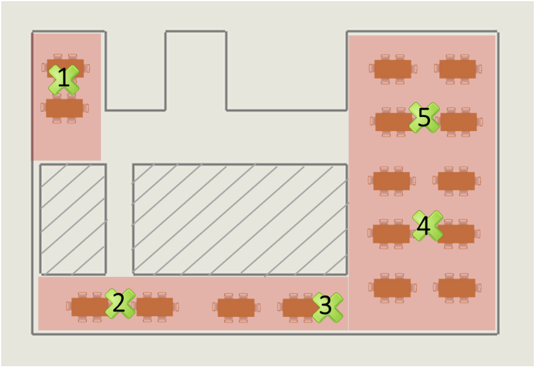
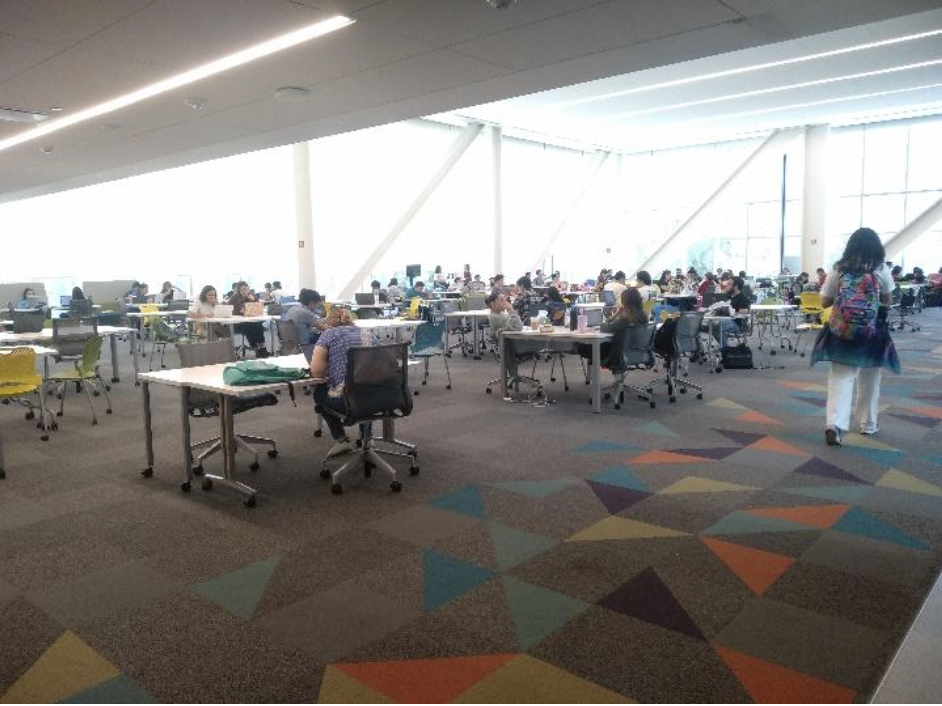
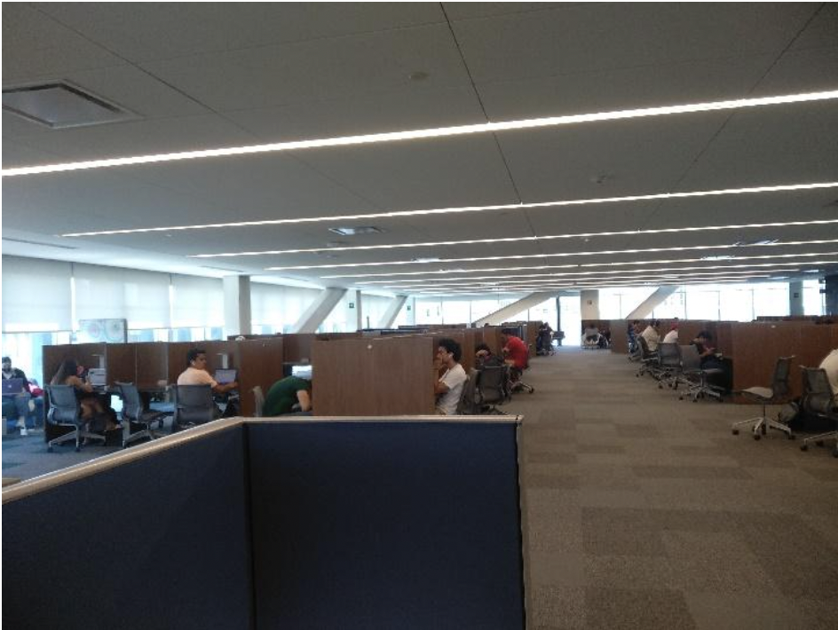
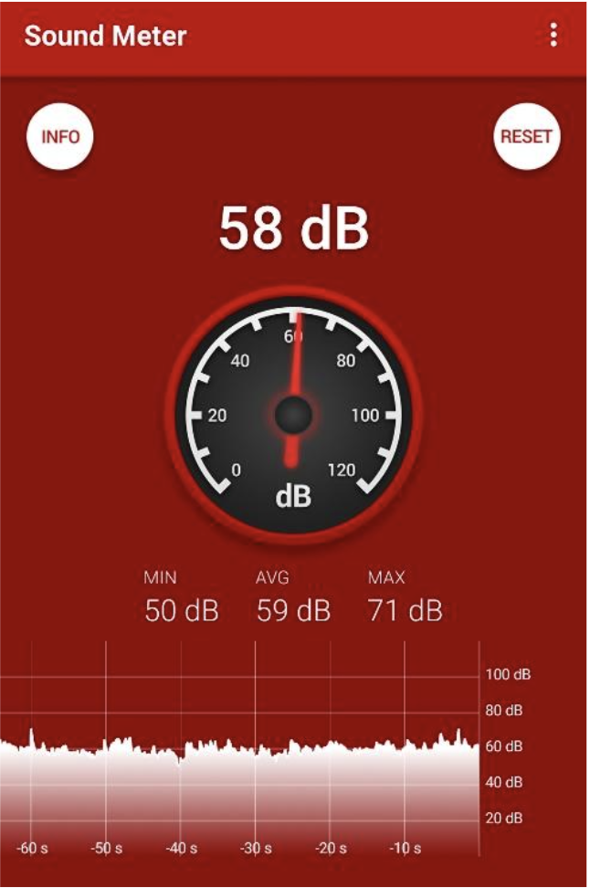

```{R echo = FALSE}
codejs <- readr::read_lines("./js/codefolding.js")
collapsejs <- readr::read_lines("./js/collapse.js")
transitionjs <- readr::read_lines("./js/transition.js")
dropdownjs <- readr::read_lines("./js/dropdown.js")

htmlhead <- c(
  paste('
<script>',
paste(transitionjs, collapse = "\n"),
'</script>
<script>',
paste(collapsejs, collapse = "\n"),
'</script>
<script>',
paste(codejs, collapse = "\n"),
'</script>
<script>',
paste(dropdownjs, collapse = "\n"),
'</script>
<style type="text/css">
.code-folding-btn { 
  margin-bottom: 4px; 
  color: #fff;
  background-color: #007bff;
  border-color: #007bff;
  border-radius: 0.25rem;
  border: 1px solid transparent;
  padding: 0.375rem 0.75rem;
  transition: color .15s ease-in-out,background-color .15s ease-in-out,border-color .15s ease-in-out,box-shadow .15s ease-in-out;
}
.row { display: flex; }
.collapse { display: none; }
.in { display:block }
.pull-right > .dropdown-menu {
    right: 0;
    left: auto;
}
.open > .dropdown-menu {
    display: block;
}
.dropdown-menu {
    position: absolute;
    top: 100%;
    left: 0;
    z-index: 1000;
    display: none;
    float: left;
    min-width: 160px;
    padding: 5px 0;
    margin: 2px 0 0;
    font-size: 14px;
    text-align: left;
    list-style: none;
    background-color: #fff;
    -webkit-background-clip: padding-box;
    background-clip: padding-box;
    border: 1px solid #ccc;
    border: 1px solid rgba(0,0,0,.15);
    border-radius: 4px;
    -webkit-box-shadow: 0 6px 12px rgba(0,0,0,.175);
    box-shadow: 0 6px 12px rgba(0,0,0,.175);
}
.personalized-button {
    color: #fff;
    background-color: #007bff;
    border-color: #007bff;
    border-radius: 0.25rem;
    border: 1px solid transparent;
    padding: 0.375rem 0.75rem;
    transition: color .15s ease-in-out,background-color .15s ease-in-out,border-color .15s ease-in-out,box-shadow .15s ease-in-out;
}
</style>
<script>
$(document).ready(function () {
  window.initializeCodeFolding("show" === "hide");
});
</script>
', sep = "\n"),
  paste0('
<script>
document.write(\'<div class="btn-group pull-right" style="position: absolute; top: 20%; right: 2%; z-index: 200"><button type="button" class="btn btn-default btn-xs dropdown-toggle personalized-button" data-toggle="dropdown" aria-haspopup="true" aria-expanded="true" data-_extension-text-contrast=""><span>Code</span> <span class="caret"></span></button><ul class="dropdown-menu" style="min-width: 50px;"><li><a id="rmd-show-all-code" href="#">Show All Code</a></li><li><a id="rmd-hide-all-code" href="#">Hide All Code</a></li></ul></div>\')
</script>
')
)

readr::write_lines(htmlhead, path = "./header.html")
```

# Myth busters 2

Myth busters 2, where measurements are quantitative (e.g., temperature, volume, etc.). Select a myth you would like to check where two groups are involved. For instance, one group can be a control group, and the other can be a treatment group.

1. Describe the problem and variables to measure.
2. Objective.
3. Determine a data collection procedure that involves a randomization process.
4. Describe the measurement system implemented.
5. Determine possible noise factors.
6. Statistical methods used.
7. Assumptions.
8. Experimental restrictions.
9. Data collection.
10. Descriptive analysis.
11. Individual sample estimation of parameters and confidence intervals.
12. Assumptions validation.
13. Analysis of the experiment (two sample comparisons).
    + Hypothesis used.
    + Significance level.
    + Calculations.
    + Statistical conclusion.
    + Practical conclusion.

```{R echo = FALSE}
specify_decimal <- function(x, k) trimws(format(round(x, k), nsmall=k))
suppressWarnings(library(kableExtra)) #Use development version remotes::install_github("haozhu233/kableExtra") - CRAN version has a bug for collapse_rows function
```

## Problem description and variables to measure

The Tecnológico de Monterrey´s library is a popular spot for the students to get together to study and work on projects. However, a common problem found inside is that there is a lot of noise, usually generated by the students themselves. The 4th and 2th floor have the bigger areas to work in, and it is common knowledge that the 4th floor is less noisy than the 2nd, which raises the question **Is the 2nd floor noisier than the 4th?**

To answer this question, a Hypothesis Test will be conducted, where the *decibels* in each floor will be measured, an average will be calculated, and then a statistical analysis will be developed to formulate a conclusion.

## Objective

To determine whether the 2nd floor of the library is noisier than the 4th floor.

## Data collection procedure that involves a randomization process

The data collection procedure consisted in taking measurements of the noise level in the library on the 2nd and 4th floor during random conditions. Neither the people in the floors nor the conditions of the library were previously defined, as these had to be random to avoid any bias in the sample data.

## Measurement system implemented

Both floors have a similar layout, and to take the measurements, 5 strategic parts were elected. In Figure \@ref(fig:library-2nd-4th-floor-points), the layout for both floors can be seen, as well as the measurement points in each floor, marked as green “x”. The numbers in each one of them represent the order in which the measurements were taken. The red zones are the areas where most people conglomerate, as it can be seen, it is practically identical for both floors. The measurements were taken during 5 days, from Monday to Friday, during the same time frame, from 11:30 am to 12:00 pm.

```{R library-2nd-4th-floor-points, fig.cap="2nd floor (left) and 4th floor (right) of the library and measurement points", fig.show = "hold", out.width = '50%', fig.align = 'center'}

knitr::include_graphics("images/library_4th_floor.png")
```

Pictures from both the 2nd and 4th floor are shown in Figure \@ref(fig:library-2nd-4th-floor-pictures).

```{R library-2nd-4th-floor-pictures, fig.cap="Biggest work area in the 2nd floor (left) and 4th floor (right)", fig.show = "hold", out.width = '50%', fig.align = 'center'}


```

To measure the noise level, an app called “Sound Meter” was used. It was chosen because it is one of the best rated apps from this type within the app store. The app takes continuous measurements in decibels, showing the maximum, average, and minimum values given an amount of time defined by the user, in this case, one minute. This can be seen in Figure \@ref(fig:sound-meter).

```{R sound-meter, fig.cap="Example of measurements taken by the “Sound Meter” app", fig.align = 'center', out.width = '35%'}

```

##  Noise factors

To reduce the risk of bias in the process, the following considerations were taken.

1. The measurements were taken:
    - From the same smartphone
    - In each point during one minute
    - In the same points during the five week days
    - In the same time range, from 11:30 am to 12 pm
    - At least 2 meters away from the the closest person
2. It was avoided to generate any type of vibrations that could affect the measurements, for example, smartphone notifications, table vibrations, etc. When it was suspected that there was interference, the measurement was taken again.

## Statistical methods used

Given that we are comparing the differences between two groups of data, the statistical method used is a Test with Paired Data, which means that we treat the differences between the two groups as just one sample.

## Assumptions

We are assuming that both populations follow normal distributions.

## Experimental restrictions

Because only one smartphone had to be used to take the measurements to avoid any bias between the microphones, the measurements were not taken at the same time, rather, they had a couple minutes of difference between each other.

## Data collection

The data collected is presented in Tables \@ref(tab:data-2nd-floor) and \@ref(tab:data-4th-floor), where each individual measurement is shown. For each table, the data shows the decibels measured in each position in each day, divided in three sections, the minimum, maximum, and average values.

```{R data-2nd-floor}
floor_2_days <- c(rep("Day 1 (23/05/2022)", 3), rep("Day 2 (24/05/2022)", 3), rep("Day 3 (25/05/2022)", 3), rep("Day 4 (26/05/2022)", 3), rep("Day 5 (27/05/2022)", 3))
floor_2_indices <- rep(c("Min", "Max", "$\\textbf{Average}$"), 5)
floor_2_pos_1 <- c(50, 64, 56, 45, 74, 55, 44, 62, 51, 53, 70, 53, 47, 71, 55)
floor_2_pos_2 <- c(52, 63, 56, 55, 66, 59, 53, 64, 57, 53, 64, 56, 52, 61, 55)
floor_2_pos_3 <- c(50, 71, 59, 50, 67, 58, 45, 67, 53, 49, 70, 59, 50, 64, 56)
floor_2_pos_4 <- c(54, 68, 62, 49, 73, 60, 49, 76, 57, 50, 78, 58, 50, 69, 60)
floor_2_pos_5 <- c(53, 68, 59, 49, 66, 55, 51, 68, 59, 48, 64, 55, 49, 61, 54)
floor_2 <- data.frame(floor_2_days, floor_2_indices, floor_2_pos_1, floor_2_pos_2, floor_2_pos_3, floor_2_pos_4, floor_2_pos_5)
colnames(floor_2) = c("", "", "pos_1", "pos_2", "pos_3", "pos_4", "pos_5")
floor_2_means <- rowMeans(floor_2[3:7])
floor_2$Mean <- floor_2_means
floor_2%>%
  kbl(align = "c", caption = "Data collected from the 2nd floor")%>%
  kable_material(bootstrap_options = c("striped", "hover", "condensed", "responsive"), full_width = F)%>%
  add_header_above(c("Days", "Measurements (dB)" = 7), background = "#2E75B5", color = "#FFFFFF")%>%
  add_header_above(c("2nd floor" = 8), background = "#1E4379", color = "#FFFFFF")%>%
  row_spec(0, background = "#9CC2E5")%>%
  row_spec(seq(3, 15, by = 3), bold = T, background = "#DEEAF6")%>%
  column_spec(1, bold = T, background = "#9CC2E5")%>%
  column_spec(2, background = "#DEEAF6")%>%
  column_spec(8, background = "#DEEAF6")%>%
  collapse_rows()%>%
  scroll_box(width = "100%", height = "800px", fixed_thead = T)
```

```{R data-4th-floor}
floor_4_days <- c(rep("Day 1 (23/05/2022)", 3), rep("Day 2 (24/05/2022)", 3), rep("Day 3 (25/05/2022)", 3), rep("Day 4 (26/05/2022)", 3), rep("Day 5 (27/05/2022)", 3))
floor_4_indices <- rep(c("Min", "Max", "$\\textbf{Average}$"), 5)
floor_4_pos_1 <- c(51, 73, 59, 57, 72, 64, 51, 64, 57, 51, 74, 59, 55, 80, 60)
floor_4_pos_2 <- c(57, 71, 63, 56, 73, 62, 53, 70, 61, 52, 72, 61, 55, 73, 62)
floor_4_pos_3 <- c(49, 65, 55, 47, 66, 53, 49, 64, 55, 53, 79, 59, 48, 64, 55)
floor_4_pos_4 <- c(41, 62, 49, 41, 64, 51, 40, 76, 48, 38, 62, 46, 42, 66, 50)
floor_4_pos_5 <- c(50, 66, 55, 45, 67, 50, 48, 63, 51, 46, 64, 50, 48, 63, 53)
floor_4 <- data.frame(floor_4_days, floor_4_indices, floor_4_pos_1, floor_4_pos_2, floor_4_pos_3, floor_4_pos_4, floor_4_pos_5)
colnames(floor_4) = c("", "", "pos_1", "pos_2", "pos_3", "pos_4", "pos_5")
floor_4_means <- rowMeans(floor_4[3:7])
floor_4$Mean <- floor_4_means
floor_4%>%
  kbl(align = "c", caption = "Data collected from the 4th floor")%>%
  kable_material(bootstrap_options = c("striped", "hover", "condensed", "responsive"), full_width = F)%>%
  add_header_above(c("Days", "Measurements (dB)" = 7), background = "#C55A11", color = "#FFFFFF")%>%
  add_header_above(c("4th floor" = 8), background = "#833C0B", color = "#FFFFFF")%>%
  row_spec(0, background = "#F4B083")%>%
  row_spec(seq(3, 15, by = 3), bold = T, background = "#FBE4D5")%>%
  column_spec(1, bold = T, background = "#F4B083")%>%
  column_spec(2, background = "#FBE4D5")%>%
  column_spec(8, background = "#FBE4D5")%>%
  collapse_rows()%>%
  scroll_box(width = "100%", height = "800px", fixed_thead = T)
```

On the other hand, Table \@ref(tab:diff-between-floors) shows only the average values of each day and each floor, followed by the difference between the two. The third column is the data that is going to be used in the Hypothesis Testing.

```{R diff-between-floors}
#Mean
mean_floor_2 <- floor_2$Mean[seq(3, 15, by = 3)]
mean_floor_4 <- floor_4$Mean[seq(3, 15, by = 3)]
mean_diff_floors <- mean_floor_2 - mean_floor_4
mean_floors <- data.frame(1:5, mean_floor_2, mean_floor_4, mean_diff_floors)
colnames(mean_floors) = c("#", "2nd floor", "4th floor", "Difference")

mean_floors%>%
  kbl(align = "c", caption = "Difference between the data measured")%>%
  kable_material(bootstrap_options = c("striped", "hover", "condensed", "responsive"), full_width = F)%>%
  add_header_above(c("Measurements" = 4), background = "#548135", color = "#FFFFFF")%>%
  scroll_box(width = "100%")
```

## Descriptive analysis

At first glance, the data seems to indicate that the 2nd floor is slightly louder than the 4th. The highest difference is $2.2 dB$ louder for the 2nd floor than the 4th, while the lowest is $0 dB$. It is important to note that this difference is the average of the measurements, as the individual comparisons between each measurement point vary.

Because the sample size is only 5, and the difference is not significant, a Hypothesis Testing must take place in order to formulate a conclusion. 

## Individual sample estimation of parameters and confidence intervals

```{R}
mean_mean_diff_floors <- mean(mean_diff_floors)
std_dev_mean_diff <- sd(mean_diff_floors)
n_days <- length(mean_floor_2)
doF <- n_days - 1
alpha_diff <- 0.05 
alpha_diff_2 <- alpha_diff/2
t_statistic <- abs(qt(alpha_diff_2, doF))
```

$$
\begin{gather*}
\bar{D} = `r specify_decimal(mean_mean_diff_floors, 4)` \\
s_D = `r specify_decimal(std_dev_mean_diff, 4)` \\
n = `r n_days` \\
v = `r n_days` - 1 = `r doF` \\
\alpha = `r alpha_diff` \\
t_{n-1, \alpha/2} = t_{`r doF`, `r alpha_diff_2`} = `r specify_decimal(t_statistic, 4)`
\end{gather*}
$$

```{R}
lower_CI_D <- mean_mean_diff_floors - t_statistic*(std_dev_mean_diff/sqrt(n_days))
upper_CI_D <- mean_mean_diff_floors + t_statistic*(std_dev_mean_diff/sqrt(n_days))
```

### Confidence Interval ($95\%$)

$$
\begin{gather*}
\bar{D} \pm t_{n-1, \alpha/2} \frac{s_D}{\sqrt{n}} \\
`r specify_decimal(mean_mean_diff_floors, 4)` \pm `r specify_decimal(t_statistic, 4)` \frac{`r specify_decimal(std_dev_mean_diff, 4)`}{\sqrt{`r n_days`}} \\
(`r specify_decimal(lower_CI_D, 4)`, `r specify_decimal(upper_CI_D, 4)`)
\end{gather*}
$$

## Assumptions validation

To validate the assumption that the population is normally distributed, a bootstrap simulation was done by choosing 5 random values from the sample gathered and repeating the experiment 1000 times. Then, the mean of each simulated sample was graphed and the result is shown in Figure \@ref(fig:db-mean-diff-probability-plot). As it can be seen, it shows that the data follows mostly a normal distribution, which validates the initial assumption.

```{R}
#Since we don't know the data distribution we will do bootstrapping (with replacement)
#Boot library makes it easy to work with bootstrapping 
library(boot)

#First we must create a function that will calculate the desired statistic from the bootstrapped data
#In our case, we need the mean
#The two required parameters for the function are the data (vector with the mean differences), and i is a randomly generated integer that goes from 1 to the size of the data vector
samples_means <- function(data, i) {
  #This will be repeated n times, where n is the size of the data vector
  #So val will be an n size vector that has randomly selected elements from data vector (sampling with repetition)
  val <- data[i]
  #Calculate the mean
  sample_x_bar <- mean(val) 
  return(c(val, sample_x_bar))
} 

#boot handles all the re sampling with repetition using the above declared function
#It recieves the data from which the items will be resampled, the function, and the number of times we want to repeat the process
bootstrap_data <- boot(mean_diff_floors,samples_means,R=1000)
```

```{R bootstrap-simulated-data-table}
elements_numbers <- 1:1000
simulated_data_1 <- bootstrap_data$t[,1]
simulated_data_2 <- bootstrap_data$t[,2]
simulated_data_3 <- bootstrap_data$t[,3]
simulated_data_4 <- bootstrap_data$t[,4]
simulated_data_5 <- bootstrap_data$t[,5]
simulated_mean <- bootstrap_data$t[,6]
table_titles <- c("i", "$D_1^*$", "$D_2^*$", "$D_3^*$", "$D_4^*$", "$D_5^*$", "$\\bar{D}^*$")

simulated_data_table <- data.frame(elements_numbers, simulated_data_1, simulated_data_2, simulated_data_3, simulated_data_4, simulated_data_5, simulated_mean)

colnames(simulated_data_table) <- table_titles

knitr::kable(simulated_data_table, align = "c", caption = "Simulated data table")%>%
  kable_styling(position = "center", full_width = F)%>%
  scroll_box(width = "100%", height = "800px", fixed_thead = T, extra_css = "margin-left: auto; margin-right: auto;")
```

```{R db-mean-diff-probability-plot, fig.cap = "Histogram and probability plot for simulated mean \n difference between floor sound levels averages", fig.align = 'center', out.width = "80%"}
#After the data has been shown in a table, remove it from bootstrap_data in order to be able to plot it
bootstrap_data$t = subset(bootstrap_data$t, select = -c(1, 2, 3, 4, 5))

#To put both plots in the same line
par(mfrow = c(1, 2))

#Plot histogram
h <- hist(bootstrap_data$t, main = "Bootstrap simulation \n distribution", xlab = "Simulated mean difference between \n floors point averages", ylab = "Frequency", col = "green")

#Plot normal curve on top of histogram
xfit <- seq(min(bootstrap_data$t), max(bootstrap_data$t), length = 40) 
yfit <- dnorm(xfit, mean = mean(bootstrap_data$t), sd = sd(bootstrap_data$t)) 
yfit <- yfit * diff(h$mids[1:2]) * 1000 

lines(xfit, yfit, col = "red", lwd = 2)

#Plot QQ plot
qqnorm(bootstrap_data$t, main = "Probability plot for simulated \n mean difference between floors", col = "green", pch = 19)

#To create straight line for QQ plot
qqline(bootstrap_data$t, col = "red", lwd = 3, qtype = 6, distribution = qnorm)
```

## Analysis of the experiment (two sample comparisons)

### Hypothesis used

$$
\begin{gather*}
H_0: \mu_D \le 0 \\
H_1: \mu_D \gt 0 \\
\end{gather*}
$$

### Significance level

$$\alpha = `r alpha_diff`$$

### Calculations

Data presented in section [Individual sample estimation of parameters and confidence intervals] will be reused here.  

```{R}
u0 <- 0
t_test <- (mean_mean_diff_floors - u0)/(std_dev_mean_diff/sqrt(n_days))
p_value_D <- pt(t_test, doF, lower.tail = F)
```

$$
\begin{gather*}
t = \frac{\bar{D}-\mu_0}{s_D/\sqrt{n}} = t = \frac{`r specify_decimal(mean_mean_diff_floors, 4)`-`r u0`}{`r specify_decimal(std_dev_mean_diff, 4)`/\sqrt{`r n_days`}} = `r specify_decimal(t_test, 4)` \\
P = `r specify_decimal(p_value_D, 4)`
\end{gather*}
$$
The above can be verified using R built-in formulas as shown beneath.

```{R}
t.test(mean_floor_2, mean_floor_4, paired = T, alternative = "greater", conf.level = 0.95)
```

## Statistical conclusion

$$P-value < \alpha$$

## Practical conclusion

$H_0$ is rejected, therefore, there is sufficient evidence to conclude that the noise level in the 2nd floor is higher than the 4th floor.
